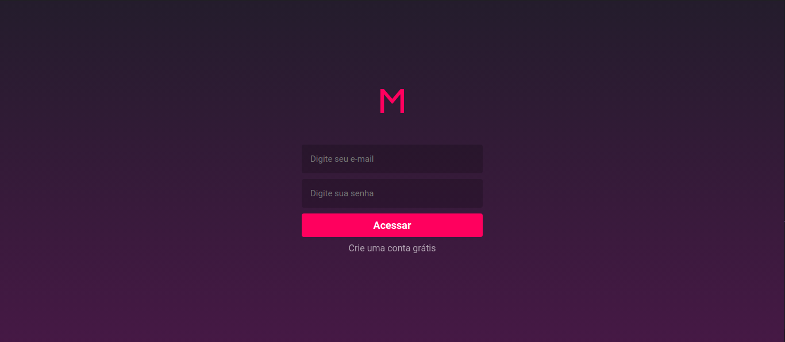
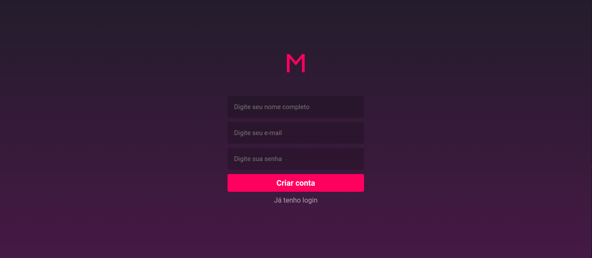
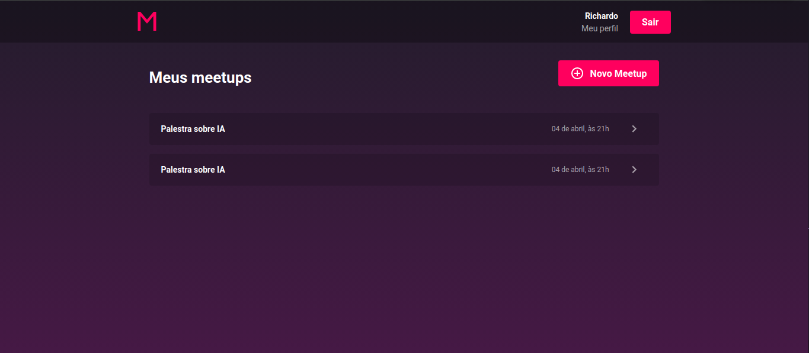
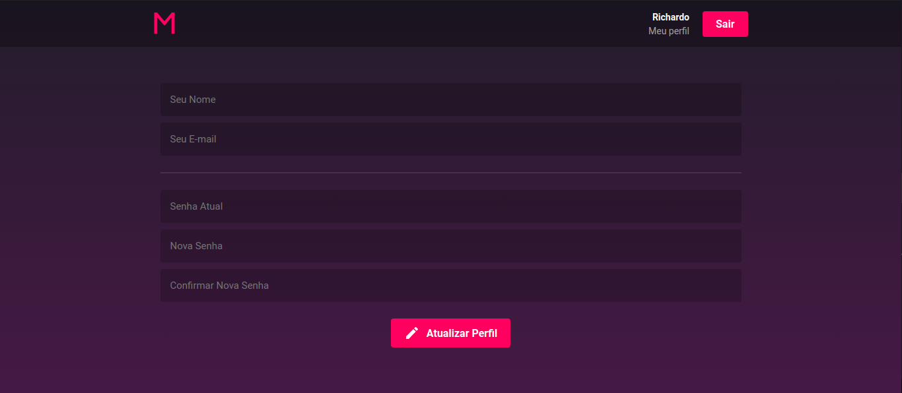
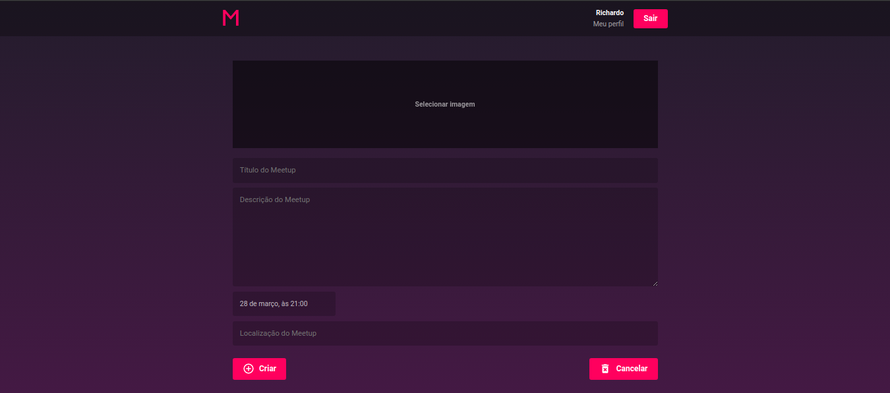

<h4 align="center">
 
 <b>Event app for meetings & amazing events</b>
</h4>

  <a href="#sobre">Sobre</a>&nbsp;&nbsp;&nbsp;|&nbsp;&nbsp;&nbsp;
  <a href="#tecnologias-utilizadas">Tecnologias</a>&nbsp;&nbsp;&nbsp;|&nbsp;&nbsp;&nbsp;
  <a href="#aplicação">Aplicação</a>

# Sobre

Meetupp é um app agregador de eventos para desenvolvedores criada durante o desafio do Bootcamp GoStack 8.0 da Rocketseat.

# Tecnologias utilizadas

### Backend
- NodeJS
- Express
- Sequelize (Utilizando PostgresSQL)
- Docker
- Autenticação JWT

### Frontend
- ReactJS
- React Hooks
- Redux
- Sagas
- Styled-components
- Reactotron

# Aplicação

Foi implementado o Back-end e o Front-end da aplicação.

## Funcionalidades

- Autenticação: Permite que um usuário se autentique na aplicação utilizando e-mail e senha, feita utilizando JWT. A aplicação realiza validação dos dados do usuário.
- Cadastro e atualização de usuários: Permite que novos usuários se cadastrem nua aplicação utilizando nome, e-mail e senha.
Para atualizar a senha, o usuário deve também enviar um campo de confirmação com a mesma senha.
- Criar e modificar Meetups existentes
- Envio de e-mail para o organizador do Meetup com informações do usuário inscrito no Meetup

##  Interface

